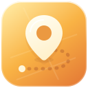

  

# WhereTo · 어디가?

**어디로 갈지 고민될 때, 지도에서 뽑아보세요.**

오늘 점심을 먹을 식당, 잠시 쉬어갈 카페, 주말에 둘러볼 동네.
WhereTo는 내가 고른 지역 안에서 다음에 가볼 장소를 랜덤으로 골라주는 서비스입니다.

[WhereTo 시작하기 →](https://whereto-swart.vercel.app)

## 원하는 동네에서, 원하는 장소를

가까운 곳을 찾고 싶다면 **내 위치로 이동**을 눌러보세요. 현재 위치를 중심으로 지도를 100m 축척에 맞춰 보여줍니다. 다른 동네가 궁금하다면 지역을 검색하거나 지도를 직접 움직여도 됩니다.

상단에서 **전체** 또는 원하는 카테고리를 고를 수 있습니다. 음식점·카페·편의점부터 문화시설·관광명소·숙박까지 18개 카테고리를 제공하며, 좌우로 밀어 더 많은 항목을 볼 수 있습니다.

## 네 단계면 목적지 결정

1. **동네 찾기** — 현재 위치, 지역 검색, 지도 이동으로 가고 싶은 동네를 찾습니다.
2. **종류 고르기** — 음식점이나 카페처럼 원하는 카테고리를 선택합니다. 정해둔 것이 없다면 `전체`로 두세요.
3. **영역 정하기** — `영역 지정`을 누르고 지도에 점을 세 개 이상 찍은 뒤 `지정`을 누릅니다. 점을 이어 만든 영역 안에서 장소를 찾습니다.
4. **장소 뽑기** — `뽑기`를 눌러 오늘의 목적지를 확인합니다.

다른 장소를 보고 싶으면 **다시 뽑기**, 다른 동네나 범위를 고르고 싶으면 **영역 재지정**을 눌러보세요. 영역이나 카테고리를 바꾼 뒤에도 직접 `뽑기`를 눌렀을 때 새 장소를 골라줍니다.

## 골랐다면 바로 출발

**카카오맵에서 확인**을 누르면 뽑힌 장소의 상세 페이지가 열립니다. 방문하기 전에 카카오맵에 등록된 리뷰와 메뉴·가격 등을 살펴보세요.

**길찾기**를 누르면 지도 앱을 고르는 팝업이 열립니다. 카카오맵과 Google Maps로 목적지까지의 길을 확인할 수 있고, Apple 기기에서는 Apple Maps도 선택할 수 있습니다.

카카오맵 길찾기에는 뽑힌 장소가 도착지로 표시됩니다.

함께 갈 사람에게는 **장소 공유하기**로 목적지 링크를 보내세요.

## 다녀온 곳은 기록으로

방문한 장소에 별점과 메모를 남겨보세요. **방문 기록**에서 다시 찾아보거나 내용을 수정하고, 지도에서 위치를 열어볼 수 있습니다.

상단의 **뒤로**를 누르면 방문 기록을 열기 전 화면으로 돌아갑니다.

기록은 현재 기기의 브라우저에 보관됩니다. 다른 기기로 옮기거나 오래 보관하고 싶다면 **내보내기**로 백업하고 **가져오기**로 다시 불러오세요.

## 화면도 내 취향대로

지도 위에 은은하게 비치는 **Liquid Glass** 디자인과 부드러운 움직임을 담았습니다.

오른쪽 위 설정에서 유리 틴트 농도와 모션 효과를 조절할 수 있습니다. 틴트의 기본값은 80%이며, 선택한 설정은 다음 방문에도 유지됩니다.

왼쪽 위 **WhereTo**를 누르면 언제든 홈으로 돌아갈 수 있습니다.

## 이용 전에 알아두세요

- 회원가입 없이 이용할 수 있습니다. 위치 권한을 허용하지 않아도 지역 검색과 지도 이동으로 장소를 뽑을 수 있습니다.
- 추천은 지도에 등록된 장소 후보를 기준으로 합니다. 실제 영업 여부와 출입 가능 여부는 방문 전에 확인해주세요.
- 방문 기록은 기기 간에 자동으로 동기화되지 않습니다. 브라우저 데이터를 지우기 전에는 기록을 백업해주세요.
- 공유 링크에는 장소의 위치와 주소가 포함됩니다. 링크를 받은 사람은 해당 목적지를 확인할 수 있습니다.

---

**익숙한 동네에서도 새로운 목적지를 만나보세요.**

[오늘은 어디가? →](https://whereto-swart.vercel.app)
